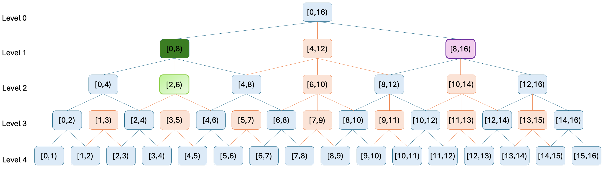

# Towards Efficient Data Structures for Approximate Search with Range Queries
This repository provides the Python implementation for the experiments detailed in the paper "Towards Efficient Data Structures for Approximate Search with Range Queries".
The research introduces the c-DAG (Directed Acyclic Graph), a novel, tunable data structure designed to enhance Single-Range-Cover (SRC) approximate range queries. Our findings demonstrate that the c-DAG provably decreases the average number of false positives by a logarithmic factor compared to the classic 1D-Tree, while maintaining asymptotically similar time and memory complexities.

## Abstract
Range queries are a fundamental operation in data retrieval, but achieving exact results can be costly. Approximate search offers a faster alternative but can introduce false positives. This work presents the c-DAG, a data-dependent structure that extends the 1D-Tree with tunable, overlapping branches ($c \geq 3$). Through a competitive analysis using a stochastic Level Difference Distribution (LDD) framework, we prove that the c-DAG incurs only a small additive constant search time overhead ($\leq 2 \cdot \frac{c-2}{c-1}$) while achieving a multiplicative logarithmic reduction in the false positive ratio ( Ω( log( $\frac{N}{s}$))). These theoretical results are extended to empirical distributions using a lightweight machine learning framework and validated on real-world datasets (Gowalla and NYC Yellow Taxi).

## Key Contributions
c-DAG Data Structure: An implementation of the c-DAG, which augments the 1D-Tree with dense overlapping intervals to provide finer canonical covers for SRC-search.\
Competitive Analysis: A formal comparative framework that analyzes the c-DAG against the 1D-Tree baseline, focusing on search time overhead and the false positive (FP) competitive ratio.\
Level Difference Distribution (LDD): The introduction of the LDD as a core technical tool to stochastically model the performance difference between the data structures.\
ML Framework for Empirical Data: A methodology to extend the theoretical analysis from uniform distributions to arbitrary, skewed, real-world data distributions.\
Empirical Validation: Experiments on the Gowalla and NYC Yellow Taxi datasets that confirm the c-DAG's practical effectiveness, showing that 3-DAG and 5-DAG consistently return deeper levels and produce substantially fewer false positives than the 1D-Tree.

## Implemented Data Structures
This project includes Python implementations for the following range-supporting data structures:\
1D-Tree: The baseline data-dependent binary tree, a one-dimensional variant of the KD-Tree.\
3-DAG: A c-DAG with a branching factor of c=3.\
5-DAG: A c-DAG with a branching factor of c=5.\
The core idea of the c-DAG is to add overlapping nodes (orange intervals in the figure below) to the standard 1D-Tree structure (blue intervals). This allows the SRC-search algorithm to find a much tighter-fitting interval for a given query, thereby reducing false positives.

*Figure 1: A 3-DAG constructed over a dataset of size16. For a query Q1 = [2, 6), the 1D-Tree returns [0, 8), while the 3-DAG returns the more precise node [2, 6).*

### Datasets
The experiments are conducted on two real-world datasets, as described in Section 7 of the paper.\
Gowalla: A location-based social network dataset of check-in timestamps. The experiments use the first 4,194,304 distinct timestamps.\
NYC Yellow Taxi: A dataset of taxi trip records from the NYC Taxi and Limousine Commission. The experiments use the first 1,048,576 distinct pickup timestamps from January 2024.

### Reproducing the Experiments
The scripts in this repository can be used to reproduce the experimental results presented in Section 7 of the paper. The main evaluation script builds the data structures, performs SRC-search for various query lengths, and computes the performance metrics.\
The experiments in the paper were conducted for the following query lengths (in seconds):\
60 (1 minute), 3600 (1 hour), 86400 (1 day), and 604800 (1 week).

## Key Results and Expected Output
Running the experiments will generate data and plots that replicate the key findings of our paper. The primary outcomes demonstrate the trade-off between a minimal increase in search depth and a significant reduction in false positives.\
Returned Level Distributions: Visualizations showing that c-DAGs consistently return nodes from deeper levels than the 1D-Tree, indicating tighter covers.\
Expected Level Difference ($E[k]$): Box plots quantifying the additive search time overhead. The results will confirm that the overhead is a small constant, with the 5-DAG often showing the lowest overhead.\
Expected FP-Competitive Ratio ($E[2^k]$): Box plots demonstrating the multiplicative reduction in false positives achieved by the c-DAGs compared to the 1D-Tree baseline.

